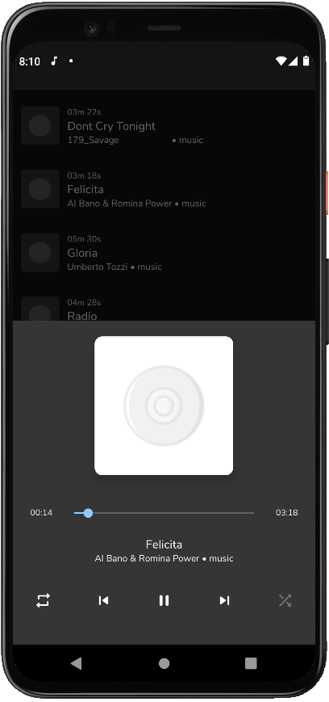

# Audio Player

Simplified version of Music Player.

Functionality:

- The player allows getting a list of media files of the device, selecting any of them, and playing with the display of
  progress, the ability to scroll forward / backward and pause the media file.

- During an incoming call, and until the end of the call, playback is suspended with the resumption of progress after
  resuming playback.

- At the end of playback there is an automatic transition to the following file.

- Looping and random transition modes are supported

