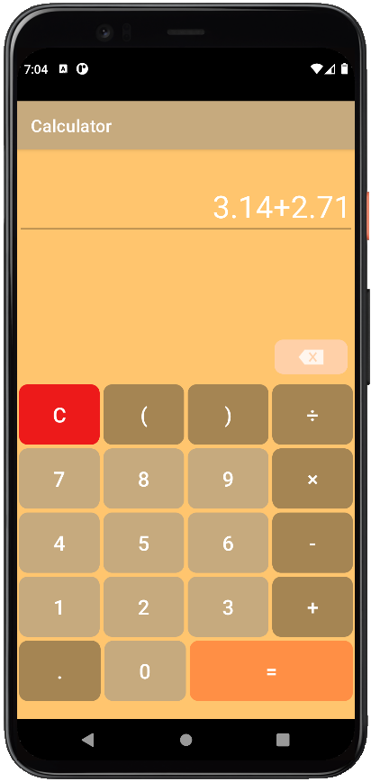

# Calculator

- Calculator for 4 basic arithmetic operations with buttons for entering arguments and actions, separate handlers for
  numbers and operations.

- The calculator has an adaptive user interface in portrait / landscape orientation and on screens of different
  resolutions.

- Preservation of a state activity on screen rotation.

## Landscape version

