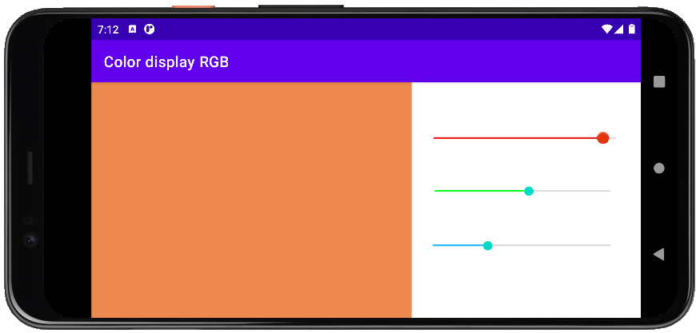

# RGB color display

- Color editor with three main RGB components that are controlled via SeekBar controls.

- The appearance of the screen depends on the orientation of the mobile device.

- Preservation of a state activity on screen rotation.

## Landscape version

