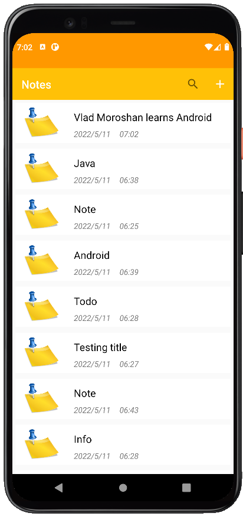

# Notes application

- Notes can be added, deleted, edited.

- ActionBar implements title note filtering.

- Implemented notes scrolling.

- Preservation of a state activity on screen rotation.

- Notes data stored in the SQLite database.

- Text inscriptions are localized for Ukrainian and English languages.

 